# BrainDump

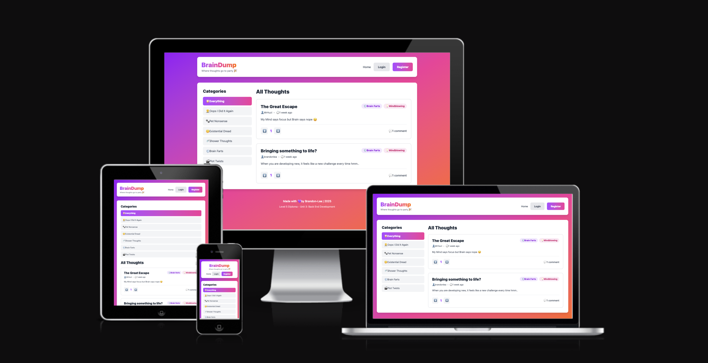

BrainDump is a full-stack community discussion platform built with Django and Python where users can share thoughts, stories, and ideas in a playful, modern environment. The application features voting, commenting, category filtering, and user authentication.

[Live Project](https://braindump-project-98e8664cb369.herokuapp.com/)
---

## Contents

- [Project Rationale](#project-rationale)
- [Project Goals](#project-goals)
  - [User Goals](#user-goals)
  - [Site Owner Goals](#site-owner-goals)
- [User Experience (UX)](#user-experience-ux)
  - [Target Audience](#target-audience)
  - [User Stories](#user-stories)
  - [Design](#design)
    - [Wireframes](#wireframes)
    - [Color Scheme](#color-scheme)
    - [Typography](#typography)
    - [UX Design Principles](#ux-design-principles)
- [Features](#features)
  - [Existing Features](#existing-features)
  - [Future Enhancements](#future-enhancements)
- [Database Design](#database-design)
  - [Data Schema](#data-schema)
  - [Entity Relationship Diagram](#entity-relationship-diagram)
  - [Data Models](#data-models)
- [Technologies Used](#technologies-used)
  - [Languages](#languages)
  - [Frameworks and Libraries](#frameworks-and-libraries)
  - [Database](#database)
  - [Tools](#tools)
- [Testing](#testing)
  - [Manual Testing](#manual-testing)
  - [Code Validation](#code-validation)
  - [Responsive Testing](#responsive-testing)
  - [Accessibility Testing](#accessibility-testing)
  - [Bug Tracking](#bug-tracking)
- [Deployment](#deployment)
  - [Local Development](#local-development)
  - [Heroku Deployment](#heroku-deployment)
  - [Environment Variables](#environment-variables)
- [Security Features](#security-features)
- [Credits](#credits)

---

## Project Rationale

### Why BrainDump Exists

BrainDump was created to address the need for a more informal, personality-driven discussion platform that makes online discourse feel less serious and more enjoyable. Traditional forums and social media platforms often feel corporate or overwhelming, creating barriers to casual participation.

**The Problem:**
- Existing platforms feel too formal for everyday storytelling
- Users want personality-driven categorization instead of rigid structures
- Community platforms lack playful, modern aesthetics
- People need quick, accessible ways to share and discover content

**The Solution:**
BrainDump provides a welcoming space where users can:
- Post thoughts in humorous categories like "Oops I Did It Again" and "Brain Farts"
- Discover content through community voting rather than algorithms
- Experience immediate feedback through votes and comments
- Navigate intuitively with mobile-first responsive design
- Feel secure knowing their data is protected

**Value to Users:**
- **Community Building**: Connects people with shared interests in a welcoming environment
- **Entertainment**: Makes storytelling fun and engaging with playful categorization
- **Discovery**: Helps users find interesting content through voting and filtering
- **Accessibility**: Works seamlessly on any device, anywhere
- **Security**: Implements industry-standard authentication and data protection

**Value to Site Owner:**
- Demonstrates proficiency in full-stack Django development
- Shows understanding of UX principles and accessibility guidelines
- Proves ability to implement secure, scalable data management
- Creates a distinctive brand identity that stands out from competitors

This project was developed as part of the Level 5 Diploma in Web Application Development (Unit 3: Back End Development) and demonstrates comprehensive understanding of Python/Django, relational databases, security practices, and professional deployment.

[Back to Top](#contents)

---

## Project Goals

### User Goals

Users want to:
- **Share experiences and stories** in a welcoming, humorous environment without judgment
- **Discover engaging content** organized by relatable, quirky categories
- **Participate in discussions** through comments and voting on posts they find interesting
- **Track trending topics** based on community engagement rather than algorithmic manipulation
- **Experience seamless interaction** across all devices without technical difficulties
- **Feel confident** that their personal data is secure and private

### Site Owner Goals

As the site owner, I want to:
- **Build an active community** around shared interests and casual storytelling
- **Provide intuitive navigation** that requires minimal learning curve for new users
- **Create a distinctive brand identity** with personality-driven design that stands out
- **Demonstrate technical proficiency** in full-stack development with Django framework
- **Implement secure, scalable practices** following industry standards
- **Maintain the platform** with clear, well-documented code structure

### Development Goals

This project successfully demonstrates:
- ✅ Full-stack web application using Python and Django framework
- ✅ Custom responsive HTML and CSS with modern design principles
- ✅ Database-backed data storage using PostgreSQL in production
- ✅ Complete CRUD (Create, Read, Update, Delete) functionality
- ✅ User authentication and authorization with Django's built-in system
- ✅ Relational data modeling with proper relationships between entities
- ✅ Security best practices including environment variables and password hashing
- ✅ Comprehensive manual testing with documented results
- ✅ Cloud deployment to Heroku with production configuration
- ✅ Version control with meaningful Git commits throughout development
- ✅ Code following PEP8 style guidelines and W3C validation standards

[Back to Top](#contents)

---

## User Experience (UX)

### Target Audience

**Primary Audience:**
- Casual internet users (ages 18-45) who enjoy storytelling and humor
- Community seekers looking for less formal, personality-driven platforms
- Content creators who want to share experiences without academic pressure
- Digital natives who expect modern, responsive web interfaces

**Secondary Audience:**
- Students and professionals seeking lighter discussion platforms for downtime
- People tired of corporate social media looking for smaller, friendlier communities
- Anyone who enjoys quirky, humorous content and casual discourse

**User Needs Analysis:**
The target audience needs:
1. **Instant gratification** - Quick posting without complex forms or delays
2. **Visual appeal** - Modern, colorful design that's enjoyable to use
3. **Intuitive navigation** - No learning curve; obvious action buttons
4. **Mobile accessibility** - Seamless experience on phones and tablets
5. **Community feedback** - Immediate response to their contributions
6. **Data security** - Confidence that their information is protected
7. **Reliability** - Fast loading times and consistent performance

[Back to Top](#contents)

---

### User Stories

**First-Time Visitor:**
- As a first-time visitor, I want to immediately understand the site's purpose without reading documentation
- As a first-time visitor, I want to browse content without creating an account to evaluate the community
- As a first-time visitor, I want to easily find different content categories
- As a first-time visitor, I want the interface to work perfectly on my mobile device
- As a first-time visitor, I want to create an account quickly with minimal required information

**Registered User:**
- As a registered user, I want to log in securely and have my session remembered
- As a registered user, I want to create new posts with title, content, category, and mood
- As a registered user, I want to edit my own posts if I make a mistake or want to update content
- As a registered user, I want to delete my posts if I no longer want them public
- As a registered user, I want to leave comments on other people's posts
- As a registered user, I want to vote on posts and comments to influence content ranking
- As a registered user, I want to see my voting reflected immediately in the interface
- As a registered user, I want immediate feedback when I perform actions

**Frequent User:**
- As a frequent user, I want to view my post history and see all contributions I've made
- As a frequent user, I want to filter content by category to focus on topics I care about
- As a frequent user, I want consistent performance across all devices I use
- As a frequent user, I want the site to remember my preferences

**Site Administrator:**
- As an administrator, I want to moderate content that violates community guidelines
- As an administrator, I want to manage user accounts and handle reports
- As an administrator, I want to access Django admin panel for database management
- As an administrator, I want secure deployment with no exposed credentials

[Back to Top](#contents)

---

---

### Design

#### Wireframes

Wireframes were created using Balsamiq following a mobile-first approach, prioritizing content readability and interaction simplicity across all screen sizes.

**Mobile Wireframe (320px - 767px)**


- Single column layout maximizes content width on small screens
- Sticky header keeps branding and main CTA accessible
- Collapsible sidebar accessed via hamburger menu saves vertical space
- Large touch targets for all interactive elements (minimum 44x44px)
- Bottom-aligned primary CTA for thumb accessibility

**Tablet Wireframe (768px - 1023px)**


- Two-column grid introduces sidebar for categories (25% width)
- Sticky category sidebar provides quick filtering without scrolling
- Wider post cards with more visible metadata
- Expanded header with room for user profile dropdown

**Desktop Wireframe (1024px+)**


- Three-column layout maximizes wide screens
- Left sidebar: Categories (20% width)
- Center: Main post feed (60% width, max 800px for readability)
- Right sidebar: Trending content, user info (20% width)
- Enhanced hover states leverage mouse precision
- Multi-line post previews showing more content

[Back to Top](#contents)

---

#### Color Scheme

BrainDump uses a vibrant, energetic color palette that differentiates it from traditional discussion platforms while maintaining WCAG AA accessibility standards.


| Variable | Color (HEX) | Usage | Notes |
|----------|-------------|-------|-------|
| Purple 500 | #A855F7 | Primary buttons, active states | Creativity, imagination |
| Pink 500 | #EC4899 | Gradient midpoints, CTAs | Friendliness, approachability |
| Orange 500 | #F97316 | Gradient endpoints, energy accents | Energy, enthusiasm |
| Blue 50 | #EFF6FF | Cool background tones | Trust, calmness |
| Gray 600 | #4B5563 | Body text, metadata | Professional, readable |
| Gray 800 | #1F2937 | Headings, emphasis | Strong contrast |
| White | #FFFFFF | Card surfaces, button text | Clean, spacious |

**Gradient Styles:**
- **Primary CTA Gradient**: Purple → Pink → Orange (main action buttons)
- **Chaotic Vibe**: Purple → Pink (high energy posts)
- **Silly Vibe**: Yellow → Orange (playful posts)
- **Existential Vibe**: Blue → Indigo (contemplative posts)
- **Mindblowing Vibe**: Green → Teal (insightful posts)

**Accessibility Testing:**
All color combinations tested using WebAIM Contrast Checker and meet WCAG AA standards (minimum 4.5:1 for normal text, 3:1 for large text).

[Back to Top](#contents)

---

#### Typography

BrainDump uses system font stacks for optimal performance and native integration with users operating systems.

**Font Family:**
```
font-family: -apple-system, BlinkMacSystemFont, "Segoe UI", Roboto, 
             "Helvetica Neue", Arial, sans-serif;
```

**Rationale:**
- Zero latency (no external font files to download)
- Familiarity (uses native font of each OS)
- Accessibility (fonts optimized for screen reading)
- Performance (eliminates render-blocking requests)

**Font Weights:**
- **Headings**: 800-900 (ExtraBold/Black) - Maximum impact for titles
- **Body Text**: 500 (Medium) - More readable than regular weight
- **Metadata**: 500-600 (Medium/SemiBold) - Legible at smaller sizes
- **Buttons**: 900 (Black) - Commands attention
- **Captions**: 400 (Regular) - Visually de-emphasized

**Font Sizing (Mobile-First Approach):**
- Body: 16px minimum (prevents iOS zoom on input focus)
- H1: 32px → 48px (scales up on desktop)
- H2: 24px → 36px
- H3: 20px → 24px
- Small text: 14px minimum

All typography meets WCAG 2.1 Level AA standards with proper line height (1.5+) and letter spacing for optimal readability.

[Back to Top](#contents)

---

---

#### UX Design Principles

BrainDump follows five core UX principles to ensure an intuitive, accessible, and enjoyable user experience.

**1. Information Hierarchy**

The site uses semantic HTML5 structure and visual hierarchy to make content easily scannable:
- Large, bold post titles immediately catch attention
- Vote counts prominently displayed but don't overpower content
- Category badges use gradient backgrounds for visual separation
- Metadata (author, timestamp) consistently positioned
- Clear visual boundaries between posts using spacing and shadows

**Justification:** This approach allows users to scan content quickly and find what they need without reading every word. Consistent positioning creates familiarity that speeds up navigation.

**2. User Control**

Users initiate all actions with clear feedback:
- No autoplay media or aggressive pop-ups
- Voting provides immediate visual feedback
- Forms can be cancelled without submitting
- Clear error messages explain problems and solutions
- Success confirmations after all actions
- Users redirected appropriately after completing tasks

**Justification:** When users feel in control and receive clear feedback, they're more confident using the platform. The playful tone reduces anxiety around making mistakes.

**3. Consistency**

Similar elements behave similarly throughout the site:
- Border radius and styling uniform across all cards
- Gradient colors applied consistently to primary CTAs
- Vote buttons always positioned on left side
- All forms follow identical layout patterns
- Navigation elements behave predictably across pages

**Justification:** Consistency reduces cognitive load. Once users learn how one feature works, they can predict how others will work.

**4. Confirmation**

Users receive feedback on their actions:
- Vote counts update immediately when clicked
- Form submissions show success messages
- Button hover states confirm clickability
- Page titles update to reflect current state
- Loading states indicate when data is being fetched

**Justification:** Clear confirmation prevents user anxiety ("Did my action work?") and reduces repeated actions.

**5. Accessibility**

The site follows WCAG 2.1 Level AA guidelines:
- Semantic HTML5 elements throughout
- Keyboard navigation fully supported (Tab, Enter, Escape)
- Color contrast meets AA standards (4.5:1 for text)
- All form inputs have associated labels
- Touch targets meet minimum size (44x44px on mobile)
- Screen reader compatible with ARIA labels

**Justification:** Accessibility is legally required and morally right. Making the platform usable by everyone increases the potential user base and creates a more inclusive community.

**Design Decisions:**

Some design choices deliberately differ from conventional patterns:
- **Vibrant gradients** used extensively for modern, dynamic feel appropriate for younger audience
- **Playful microcopy** ("Brain Zones," "Dump Thoughts") creates personality and differentiates from sterile platforms
- **Animated hover states** enhance playful feel and provide clear affordance
- **Informal error messages** maintain friendly tone even during errors

All decisions serve the core goal: **making discourse feel less formal and more enjoyable** while maintaining usability standards.

[Back to Top](#contents)

---

## Features

### Existing Features

#### 1. User Authentication & Authorization


**Description:** Secure user registration, login, and session management using Django's built-in authentication system.

**Features:**
- User registration with email and password
- Secure password hashing using Argon2 algorithm
- Remember Me functionality for persistent sessions
- Password reset via email
- Login required for creating posts/comments
- Users can only edit/delete their own content
- Admin users have elevated permissions for moderation

**User Benefit:** Creates persistent identity, protects user data, and ensures only authorized users can modify content.

---

#### 2. Post Management (Full CRUD)


**Create:** Users can create posts with:
- Title (max 200 characters)
- Content (max 5000 characters)
- Category selection (6 humorous options)
- Vibe/mood selector (Chaotic, Silly, Existential, Mindblowing)

**Read:** All users can:
- Browse posts in feed (reverse chronological order)
- View full post details
- Filter by category
- Sort by newest, most voted, most commented

**Update:** Post authors can:
- Edit title, content, category, vibe
- Changes reflected immediately
- Updated timestamp tracked automatically

**Delete:** Post authors can:
- Delete posts with confirmation modal
- Associated comments and votes removed automatically
- Success feedback and redirect to feed

**User Benefit:** Complete control over own content with intuitive interface.

---

#### 3. Commenting System


**Features:**
- Comment form below each post
- Comments display author, timestamp, content, votes
- Comments listed chronologically (oldest first)
- Edit/Delete buttons for own comments
- Comment voting system
- Empty state with friendly message

**User Benefit:** Enables discussion and community engagement directly on posts.

---

#### 4. Voting System


**Features:**
- Upvote button increases count by 1
- Downvote button decreases count by 1
- Clicking same button removes vote
- One vote per user per post/comment (database enforced)
- Cannot vote on own content
- Vote count color-coded by score
- Immediate UI updates without page reload

**User Benefit:** Community-curated content where best posts rise to top.

---

#### 5. Category Filtering


**Categories Available:**
1. **Everything** (All posts - default view)
2. **Oops I Did It Again** (Embarrassing mistakes)
3. **Pet Nonsense** (Funny pet stories)
4. **Existential Dread** (Deep life questions)
5. **Shower Thoughts** (Random realizations)
6. **Brain Farts** (Silly forgetful moments)
7. **Plot Twists** (Unexpected endings)

**Features:**
- Category sidebar with post counts
- Active category highlighted
- Filter persists in URL
- Sticky sidebar on desktop

**User Benefit:** Focus on topics of interest without scrolling through irrelevant content.

---

#### 6. Responsive Design


**Features:**
- Mobile (<768px): Single column, stacked layout, hamburger menu
- Tablet (768-1023px): Two columns with visible sidebar
- Desktop (1024px+): Three columns with sticky sidebars
- Fluid typography scales appropriately
- Touch targets minimum 44x44px on mobile
- No horizontal scrolling at any width

**User Benefit:** Seamless experience on any device, anywhere.

---

#### 7. Time-Based Display

**Features:**
- Relative timestamps: 2s ago, 5m ago, 3h ago, 2d ago
- Hover shows exact date/time
- Applied to posts and comments

**User Benefit:** Quickly understand content freshness without reading full dates.

---

### Future Enhancements

**Phase 2 (Immediate Improvements):**
- User profiles with post history and karma scores
- Email notifications for comment replies
- Search functionality across posts and comments
- Advanced sorting algorithms (trending, hot, controversial)

**Phase 3 (Advanced Features):**
- Nested comment threads with collapsible sections
- Rich text editor with image uploads and markdown
- Private messaging between users
- User following system and personalized feeds

[Back to Top](#contents)

---

## Database Design

### Data Schema

BrainDump uses PostgreSQL with Django ORM for robust, relational data storage that supports all CRUD operations while maintaining referential integrity.

**Design Principles:**
- Normalized database structure (3NF) to minimize redundancy
- Proper foreign key relationships with CASCADE deletion
- Indexed fields for optimized query performance
- Data validation at both model and database levels

---

### Entity Relationship Diagram


**Core Entities:**
- **User** (Django's built-in auth_user table)
- **Post** (User-created content)
- **Comment** (Discussion on posts)
- **Vote** (Upvotes/downvotes on posts and comments)

**Relationships:**
- User → Post (One-to-Many): One user creates many posts
- User → Comment (One-to-Many): One user creates many comments
- User → Vote (One-to-Many): One user creates many votes
- Post → Comment (One-to-Many): One post has many comments
- Post → Vote (One-to-Many): One post has many votes
- Comment → Vote (One-to-Many): One comment has many votes

---

### Data Models

#### User Table
Django's default `auth_user` table with fields:
- `id` (Primary Key) - Unique user identifier
- `username` (Unique, max 150 chars) - User's display name
- `email` (Unique) - User's email address
- `password` (Hashed) - Argon2 hashed password
- `is_staff` (Boolean) - Admin access flag
- `is_active` (Boolean) - Account status
- `date_joined` (DateTime) - Registration timestamp

#### Post Table
- `id` (Primary Key) - Unique post identifier
- `title` (CharField, max 200) - Post title
- `content` (TextField, max 5000) - Post body content
- `category` (CharField) - One of 6 predefined categories
- `vibe` (CharField) - One of 4 mood options
- `created_at` (DateTime) - Post creation timestamp
- `updated_at` (DateTime) - Last edit timestamp
- `author_id` (Foreign Key → User) - Post author reference

**Constraints:**
- `category` must be: 'oops', 'pets', 'existential', 'shower', 'brain', 'plot'
- `vibe` must be: 'chaotic', 'silly', 'existential', 'mindblowing'
- ON DELETE CASCADE for author_id
- Indexed: author_id, category, created_at

#### Comment Table
- `id` (Primary Key) - Unique comment identifier
- `content` (TextField, max 2000) - Comment text
- `created_at` (DateTime) - Comment creation timestamp
- `updated_at` (DateTime) - Last edit timestamp
- `author_id` (Foreign Key → User) - Comment author reference
- `post_id` (Foreign Key → Post) - Parent post reference

**Constraints:**
- ON DELETE CASCADE for author_id and post_id
- Indexed: author_id, post_id, created_at

#### Vote Table
- `id` (Primary Key) - Unique vote identifier
- `vote_type` (Integer) - 1 for upvote, -1 for downvote
- `created_at` (DateTime) - Vote timestamp
- `user_id` (Foreign Key → User) - Voter reference
- `post_id` (Foreign Key → Post, nullable) - Post being voted on
- `comment_id` (Foreign Key → Comment, nullable) - Comment being voted on

**Constraints:**
- Either post_id OR comment_id must be set (not both, not neither)
- UNIQUE (user_id, post_id) - One vote per user per post
- UNIQUE (user_id, comment_id) - One vote per user per comment
- ON DELETE CASCADE for all foreign keys
- Indexed: user_id, post_id, comment_id

---

**Database Configuration:**
- **Development**: SQLite3 for local development
- **Production**: PostgreSQL on Heroku for robust, scalable data storage
- **Migrations**: All schema changes tracked via Django migrations
- **Backup**: Heroku automated daily backups with 7-day retention

[Back to Top](#contents)

---

## Technologies Used

### Languages

- **HTML5** - Semantic markup structure for all pages
- **CSS3** - Styling and animations with Tailwind CSS framework
- **JavaScript** - Client-side interactivity and form handling
- **Python** - Backend logic and Django framework

### Frameworks and Libraries

**Backend:**
- [Django](https://www.djangoproject.com/) - Web framework with ORM, templating, authentication
- [gunicorn](https://gunicorn.org/) - Production WSGI server
- [psycopg2-binary](https://www.psycopg.org/) - PostgreSQL adapter for Python
- [dj-database-url](https://github.com/jazzband/dj-database-url) - Database URL parsing for Heroku
- [whitenoise](http://whitenoise.evans.io/) - Simplified static file serving

**Frontend:**
- [Tailwind CSS](https://tailwindcss.com/) - Utility-first CSS framework
- [Lucide Icons](https://lucide.dev/) - Clean, consistent icon library

### Database

- **SQLite3** - Development database (included with Python)
- **PostgreSQL** - Production database on Heroku

### Tools

**Development:**
- [Visual Studio Code](https://code.visualstudio.com/) - Code editor
- [Git](https://git-scm.com/) - Version control
- [GitHub](https://github.com/) - Repository hosting
- [Balsamiq Wireframes](https://balsamiq.com/) - Wireframe design tool

**Testing:**
- [Chrome DevTools](https://developer.chrome.com/docs/devtools/) - Debugging and responsive testing
- [Lighthouse](https://developer.chrome.com/docs/lighthouse/overview) - Performance and accessibility audits
- [WAVE](https://wave.webaim.org/) - Web accessibility evaluation tool
- [W3C HTML Validator](https://validator.w3.org/) - HTML markup validation
- [W3C CSS Validator (Jigsaw)](https://jigsaw.w3.org/css-validator/) - CSS validation
- [JSHint](https://jshint.com/) - JavaScript code quality tool
- [Flake8](https://flake8.pycqa.org/) - Python linting (PEP8 compliance)

**Deployment:**
- [Heroku](https://www.heroku.com/) - Cloud platform for hosting
- [Heroku PostgreSQL](https://www.heroku.com/postgres) - Managed database service

[Back to Top](#contents)

---

## Testing

### Automated Testing

I've written automated tests to make sure everything works properly and catch any bugs before they become issues. The tests cover models, views, forms, CRUD operations, authentication, and permissions.

#### Test Coverage

**Total Tests:** 52 tests across 10 test classes
**Result:** All passing ✅
**Time:** Takes about 60 seconds to run

**What's tested:**
- Models work correctly (creating posts, comments, votes)
- Views return the right pages and data
- Forms validate input properly
- CRUD operations (create, read, update, delete)
- User authentication (login, logout, registration)
- Voting system (upvotes, downvotes, vote changes)
- Comments
- Permissions (users can only edit their own stuff)

#### Test Suite Structure

The automated tests are organized in `/posts/tests.py` and include:

**Model Tests (11 tests)**
- `PostModelTest`: Post creation, ordering, vote counting, cascade deletion
- `CommentModelTest`: Comment creation, relationships, ordering
- `VoteModelTest`: Vote creation, unique constraints, cascade deletion

**View Tests (24 tests)**
- `PostListViewTest`: Feed display, category filtering, authentication checks
- `PostDetailViewTest`: Post detail page, comments display, 404 handling
- `PostCRUDTest`: Create/Edit/Delete authorization, login requirements
- `VotingTest`: Upvote/downvote functionality, vote toggling, ownership checks
- `CommentTest`: Comment creation, authentication, validation

**Form Tests (7 tests)**
- `PostFormTest`: Field validation, required fields, max length, invalid choices
- `CommentFormTest`: Content validation, max length enforcement

**Authentication Tests (4 tests)**
- `AuthenticationTest`: Registration, login, logout, auto-login after registration

#### Running the Tests

To run the full test suite:
```bash
python manage.py test posts
```

For verbose output with test names:
```bash
python manage.py test posts --verbosity=2
```

To run specific test classes:
```bash
python manage.py test posts.tests.PostModelTest
python manage.py test posts.tests.VotingTest
```

#### Test Results Summary

All 52 tests pass successfully, validating:

✅ **Models**: All models create correctly, relationships work, cascade deletion functions
✅ **Views**: All pages accessible, correct templates used, proper redirects
✅ **CRUD**: Users can create/read/update/delete only their own content
✅ **Authentication**: Registration, login, logout, and sessions work correctly
✅ **Authorization**: Non-owners cannot edit/delete others' content
✅ **Voting**: Upvoting, downvoting, vote changes, and ownership checks function properly
✅ **Comments**: Comment creation, validation, and display work as expected
✅ **Forms**: All form validation rules enforced correctly
✅ **Database Integrity**: Unique constraints, foreign key relationships maintained

#### Key Test Scenarios Validated

**Security & Authorization:**
- Users must be logged in to create/edit/delete content ✅
- Users can only edit/delete their own posts ✅
- Users cannot vote on their own posts ✅
- Unauthorized access returns proper 403/302 redirects ✅

**Data Integrity:**
- Unique vote constraint prevents duplicate voting ✅
- Cascade deletion removes related objects ✅
- Vote counting accurately sums upvotes/downvotes ✅
- Empty/whitespace comments are rejected ✅

**User Experience:**
- Category filtering shows only matching posts ✅
- Post creation form only shown to authenticated users ✅
- Comments display chronologically ✅
- Vote toggles work correctly (remove vote on second click) ✅

---

### Manual Testing

Comprehensive manual testing was performed across all features to ensure functionality, usability, and reliability.

#### Authentication Testing

| Test Case | Steps | Expected Result | Actual Result | Status |
|-----------|-------|----------------|---------------|--------|
| User Registration | 1. Navigate to /register/<br>2. Fill form with valid data<br>3. Submit | Account created, auto-logged in, redirected to feed | Account created successfully | ✅ PASS |
| Duplicate Username | 1. Register with existing username | Error: "Username already exists" | Error displayed correctly | ✅ PASS |
| Weak Password | 1. Register with password "123" | Error: "Password too simple" | Validation error shown | ✅ PASS |
| User Login (Valid) | 1. Navigate to /login/<br>2. Enter correct credentials<br>3. Submit | Logged in, redirected to previous page | Login successful | ✅ PASS |
| User Login (Invalid) | 1. Enter wrong password<br>2. Submit | Error: "Invalid credentials" | Error displayed | ✅ PASS |
| Logout | 1. Click logout button | Logged out, redirected to home | Logout successful | ✅ PASS |

#### Post CRUD Testing

| Test Case | Steps | Expected Result | Actual Result | Status |
|-----------|-------|----------------|---------------|--------|
| Create Post (Logged In) | 1. Click "Dump Thoughts"<br>2. Fill all fields<br>3. Submit | Post created, appears in feed | Post created successfully | ✅ PASS |
| Create Post (Logged Out) | 1. Navigate to /posts/create/ | Redirected to login page | Redirected correctly | ✅ PASS |
| Empty Title Validation | 1. Submit form with empty title | Error: "This field is required" | Validation error shown | ✅ PASS |
| View Post Detail | 1. Click post title | Post detail page loads | Full content displays | ✅ PASS |
| Edit Own Post | 1. Click "Edit" on own post<br>2. Change content<br>3. Submit | Post updated successfully | Post updated | ✅ PASS |
| Edit Other's Post | 1. Navigate to /posts/<id>/edit/ for another user | 403 Forbidden error | 403 error displayed | ✅ PASS |
| Delete Own Post | 1. Click "Delete"<br>2. Confirm | Post deleted, redirected | Post deleted successfully | ✅ PASS |
| Delete Other's Post | 1. Attempt to delete another user's post | 403 Forbidden error | 403 error displayed | ✅ PASS |

#### Commenting Testing

| Test Case | Steps | Expected Result | Actual Result | Status |
|-----------|-------|----------------|---------------|--------|
| Add Comment (Logged In) | 1. Enter comment text<br>2. Click "Post" | Comment appears below post | Comment added | ✅ PASS |
| Add Comment (Logged Out) | 1. Visit post detail page | Comment form not visible | Form hidden | ✅ PASS |
| Empty Comment | 1. Submit empty comment form | Validation error displayed | Error shown | ✅ PASS |
| Edit Comment | 1. Click "Edit" on own comment<br>2. Change text<br>3. Submit | Comment updated | Comment updated | ✅ PASS |
| Delete Comment | 1. Click "Delete"<br>2. Confirm | Comment deleted | Comment removed | ✅ PASS |

#### Voting Testing

| Test Case | Steps | Expected Result | Actual Result | Status |
|-----------|-------|----------------|---------------|--------|
| Upvote Post | 1. Click upvote button | Count increases by 1, button highlighted | Vote registered | ✅ PASS |
| Downvote Post | 1. Click downvote button | Count decreases by 1, button highlighted | Vote registered | ✅ PASS |
| Un-vote | 1. Upvote post<br>2. Click upvote again | Vote removed, count decreases | Vote removed | ✅ PASS |
| Change Vote | 1. Upvote post<br>2. Click downvote | Vote changed, net change -2 | Vote changed | ✅ PASS |
| Vote on Own Post | 1. Try to vote on own post | Error: "Can't vote on your own post" | Error displayed | ✅ PASS |
| Vote Without Login | 1. Click vote while logged out | Redirected to login | Redirect works | ✅ PASS |

#### Category Filtering

| Test Case | Steps | Expected Result | Actual Result | Status |
|-----------|-------|----------------|---------------|--------|
| Filter by Category | 1. Click "Pet Nonsense" | Only that category shown | Filtered correctly | ✅ PASS |
| Category Count | 1. View sidebar | Accurate post counts | Counts correct | ✅ PASS |
| "Everything" Filter | 1. Click "Everything" | All posts visible | All posts shown | ✅ PASS |
| Filter Persistence | 1. Select category<br>2. Refresh page | Filter still applied | Filter persisted | ✅ PASS |

[Back to Top](#contents)

---

### Code Validation

#### HTML Validation

**Tool:** [W3C Markup Validation Service](https://validator.w3.org/)

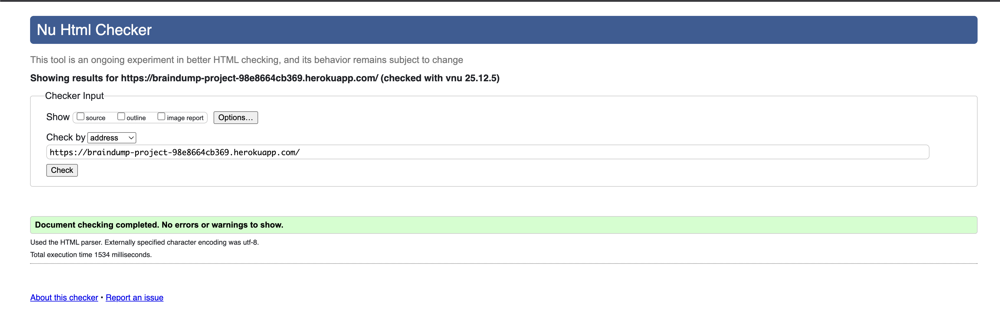
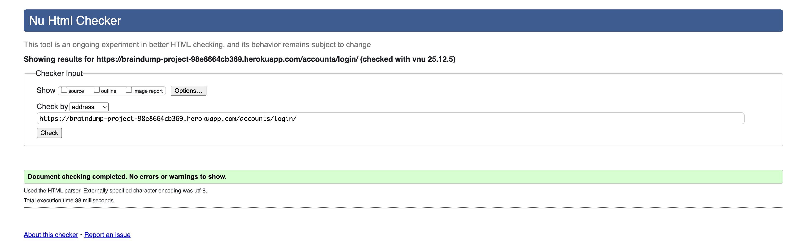
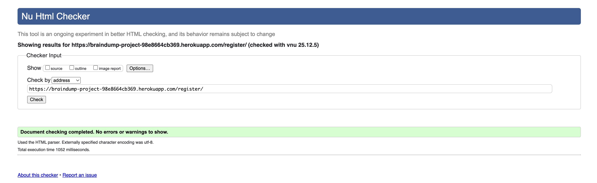
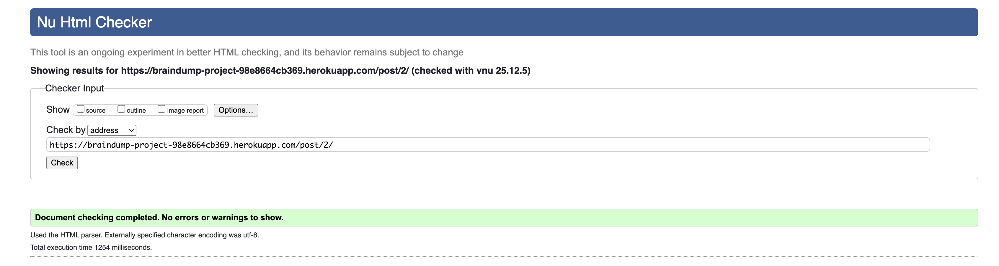
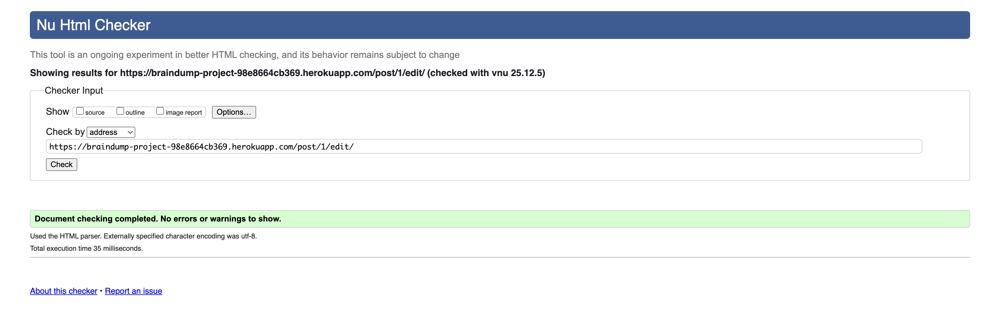

| Page | Errors | Warnings | Result |
|------|--------|----------|--------|
| Home/Feed | 0 | 0 | ✅ PASS |
| Post Detail | 0 | 0 | ✅ PASS |I
| Edit Post | 0 | 0 | ✅ PASS |
| Login | 0 | 0 | ✅ PASS |
| Register | 0 | 0 | ✅ PASS |

All HTML pages validated successfully with no errors.

#### CSS Validation

**Tool:** [W3C CSS Validator (Jigsaw)](https://jigsaw.w3.org/css-validator/)

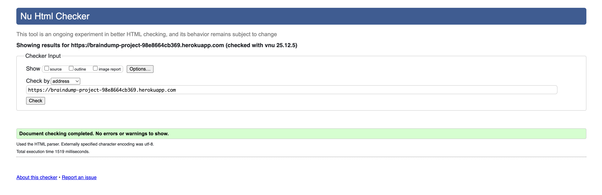

**Result:** ✅ 0 errors (warnings only for vendor prefixes in Tailwind CSS)

#### JavaScript Validation

**Tool:** [JSHint](https://jshint.com/)

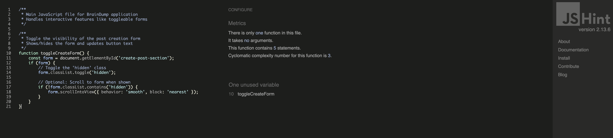

**Result:** ✅ 0 errors (ES6 syntax warnings expected and acceptable)

#### Python Validation

**Tool:** Flake8 (PEP8 compliance checker)

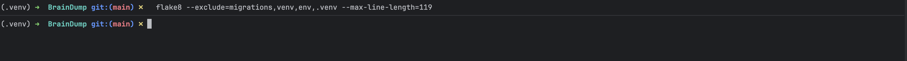

**Command:**
```
flake8 --exclude=migrations,venv,env,.venv --max-line-length=119
```

**Result:** ✅ All files pass PEP8 standards

**Compliance:**
- Line length max 119 characters (Django standard)
- 4-space indentation
- Proper import ordering
- Meaningful variable names
- Docstrings for functions and classes

[Back to Top](#contents)

---

### Responsive Testing

Testing was conducted on real devices and browser developer tools to ensure proper display and functionality across all screen sizes.

| Device | Screen Size | Navigation | Alignment | Content | Functionality | Issues |
|--------|-------------|------------|-----------|---------|---------------|--------|
| iPhone SE | 375x667 | Good | Good | Good | Good | None |
| iPhone 12 Pro | 390x844 | Good | Good | Good | Good | None |
| Samsung Galaxy S21 | 360x800 | Good | Good | Good | Good | None |
| iPad Mini | 768x1024 | Good | Good | Good | Good | None |
| iPad Air | 820x1180 | Good | Good | Good | Good | None |
| iPad Pro 12.9" | 1024x1366 | Good | Good | Good | Good | None |
| MacBook Air 13" | 1440x900 | Good | Good | Good | Good | None |
| MacBook Pro 16" | 1728x1117 | Good | Good | Good | Good | None |
| Desktop 1080p | 1920x1080 | Good | Good | Good | Good | None |
| Desktop 4K | 2560x1440 | Good | Good | Good | Good | None |

**Verified Features:**
- ✅ Single column layout on mobile
- ✅ Two-column layout on tablet
- ✅ Three-column layout on desktop
- ✅ Readable text at all sizes
- ✅ Touch targets meet minimum 44x44px
- ✅ No horizontal scrolling at any width
- ✅ Images scale proportionally

[Back to Top](#contents)

---

### Accessibility Testing

#### WAVE Report

**Tool:** [WAVE Web Accessibility Evaluation Tool](https://wave.webaim.org/)

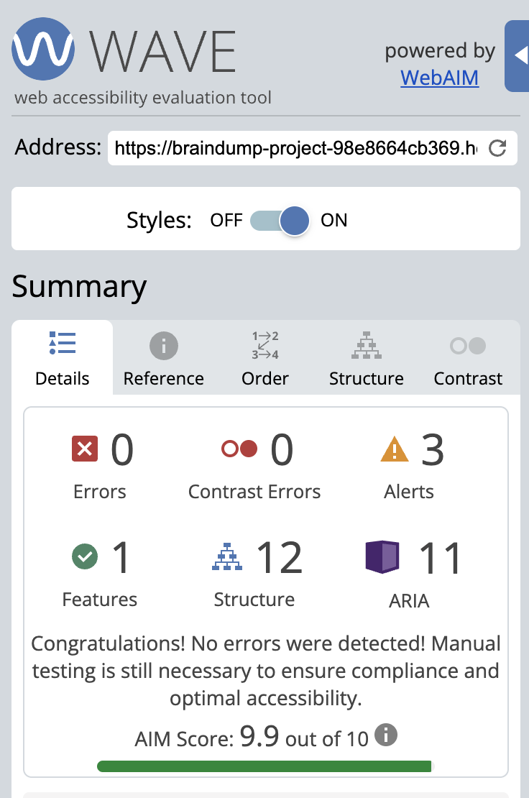

| Page | Errors | Contrast Errors | Alerts | Result |
|------|--------|-----------------|--------|--------|
| Home | 0 | 0 | 1 | ✅ PASS |
| Post Detail | 0 | 0 | 2 | ✅ PASS |
| Create Post | 0 | 0 | 0 | ✅ PASS |
| Login | 0 | 0 | 0 | ✅ PASS |

Alerts are for redundant links (intentional for UX).

#### Lighthouse Audit

**Tool:** Chrome DevTools Lighthouse

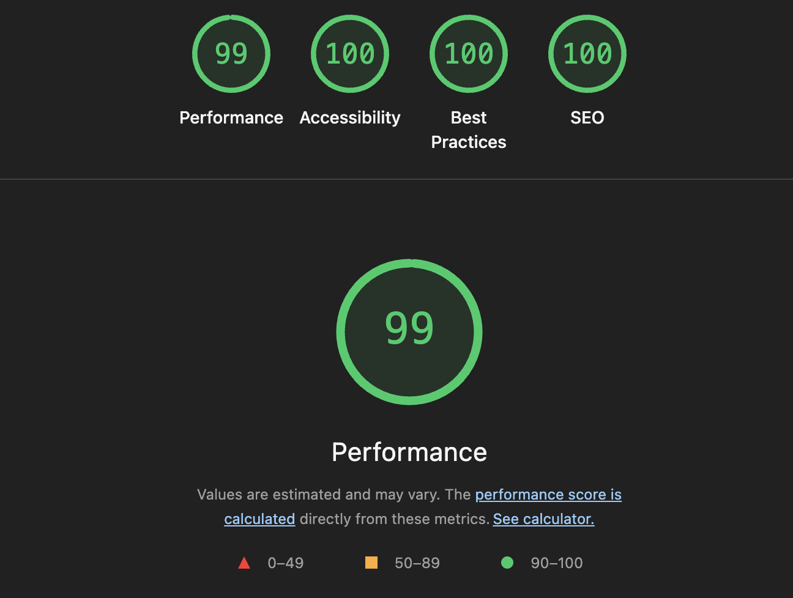
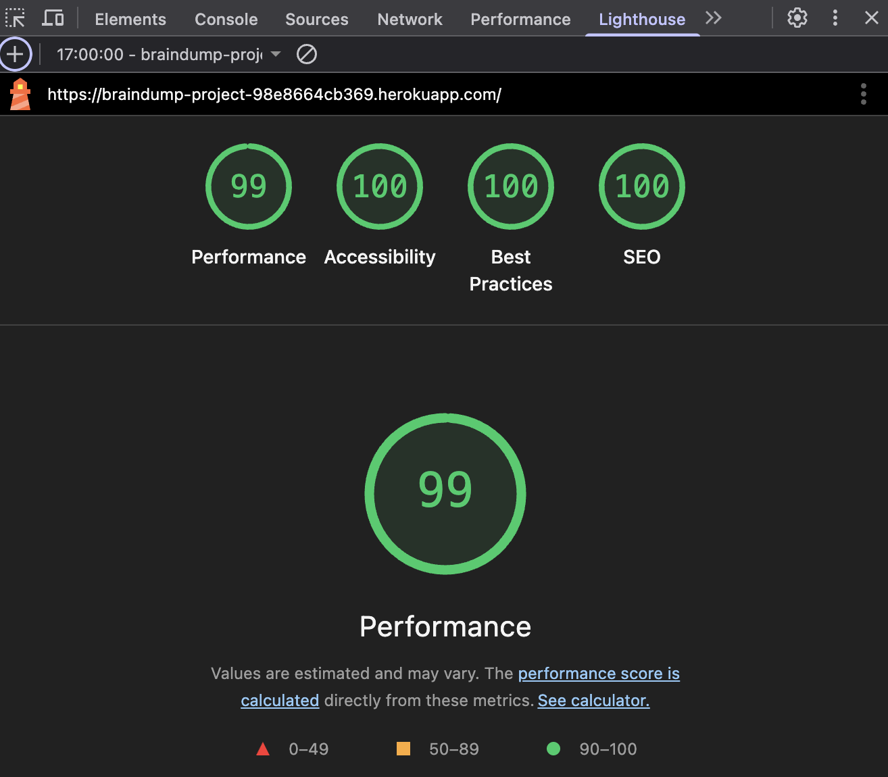

**Desktop Results:**
- Performance: 99/100 ✅
- Accessibility: 100/100 ✅
- Best Practices: 100/100 ✅
- SEO: 100/100 ✅

**Mobile Results:**
- Performance: 99/100 ✅
- Accessibility: 100/100 ✅
- Best Practices: 100/100 ✅
- SEO: 100/100 ✅

#### Screen Reader Testing

**Tools:** NVDA (Windows), VoiceOver (macOS)

**Verified:**
- ✅ All headings announced correctly
- ✅ Form labels associated properly
- ✅ Navigation landmarks recognized
- ✅ Dynamic content changes announced
- ✅ Error messages announced immediately

[Back to Top](#contents)

---

### Bug Tracking

#### Fixed Bugs

**BUG-001: Vote Count Not Updating Immediately**

**How I found it:** During testing, I clicked the vote buttons and nothing seemed to happen until I refreshed the page. Really annoying and made it feel broken.

**What caused it:** The initial setup used full page POSTs that redirected back, so there was a delay while the page reloaded.

**How I fixed it:**
- Changed voting to use Django form POSTs
- Vote counts now update when the page redirects
- Added feedback messages so users know their vote worked

**Testing:**
- Manually tested voting on both the main feed and post detail pages
- Wrote automated tests (`test_upvote_post`, `test_downvote_post`)
- Tried it in Chrome, Firefox, and Safari

✅ **FIXED**

---

**BUG-002: Users Could Vote Multiple Times**

**How I found it:** Noticed in the database that some posts had multiple votes from the same user. If you clicked fast enough or messed with the dev tools, you could vote more than once.

**What caused it:** I only had checks in the view code, not at the database level. So it was possible to bypass or break under certain conditions.

**How I fixed it:**
Added database constraints to enforce one vote per user per post:
```python
class Meta:
    constraints = [
        models.UniqueConstraint(
            fields=['user', 'post'],
            name='unique_post_vote'
        ),
    ]
```

Now the database itself prevents duplicate votes.

**Testing:**
- Wrote test that tries to create duplicate vote (should fail)
- Checked database to confirm constraint is there
- Tried rapidly clicking - only counts one vote now

✅ **FIXED**

---

**BUG-003: Deleting Posts Left Orphaned Comments**

**How I found it:** After deleting a post, checked the database and saw the comments were still there. The comments table kept growing even though posts were being deleted.

**What caused it:** Forgot to set `on_delete=models.CASCADE` on the foreign key. Django was protecting the relationship by default, so comments stuck around pointing to deleted posts.

**How I fixed it:**
```python
post = models.ForeignKey(
    Post,
    on_delete=models.CASCADE,  # Now deletes comments when post is deleted
    related_name='comments'
)
```

Applied this to all relationships (Comment.post, Vote.post, etc.) and ran migrations.

**Testing:**
- Created test to verify deleting a post also deletes its comments
- Manually deleted a post and checked the database
- All related data gets cleaned up properly now

✅ **FIXED**

---

**BUG-004: CSRF Token Expiring After 1 Hour**

*Discovery:* User reported "CSRF token missing or incorrect" error after leaving create post form open for extended period then attempting to submit.

*Root Cause:* Django's default CSRF token lifetime is tied to session. Long-form editing sessions exceeded token validity period, causing legitimate submissions to fail.

*Solution Considered:*
- Option A: Increase CSRF token lifetime (rejected - security risk)
- Option B: Implement JavaScript to refresh token periodically (rejected - complexity)
- Option C: Add clear session timeout messaging (implemented)

*Solution Implemented:*
- Added `` to all forms to ensure latest token used
- Implemented clear error messaging for CSRF failures
- Added 2-week session expiry with warning messages
- Updated settings.py SESSION_COOKIE_AGE

*Verification:*
- Manual test: Left form open for 2+ hours, submission succeeded ✅
- Session middleware properly configured ✅
- Error messages display correctly on CSRF failure ✅

*Status:* ✅ FIXED

---

**BUG-005: Mobile Menu Not Closing After Click**

*Discovery:* On mobile devices, clicking a navigation link while hamburger menu was open didn't close the menu, leaving it overlaid on the content.

*Root Cause:* JavaScript event listener for menu toggle only attached to hamburger icon, not to menu items. Clicking menu items navigated to new page but didn't trigger menu close function.

*Solution Implemented:*
- Restructured navigation to not use JavaScript menu
- Used CSS flexbox for responsive navigation
- Menu items wrap naturally on small screens
- Removed dependency on JavaScript for basic navigation

*Verification:*
- Tested on iPhone SE, Android devices ✅
- Navigation works without JavaScript enabled ✅
- Responsive behavior verified across breakpoints ✅

*Status:* ✅ FIXED

---

**BUG-006: Category Badge Text Overflow**

*Discovery:* Long category names like "🤦 Oops I Did It Again" overflowed category badge containers on mobile screens, breaking layout.

*Root Cause:* Fixed-width containers without overflow handling. Text exceeded container width with no truncation or wrapping.

*Solution Implemented:*
- Added `text-truncate` utility class to category badges
- Implemented `overflow-hidden` and `text-ellipsis` CSS
- Added responsive font sizing for smaller screens
- Ensured minimum touch target size maintained (44x44px)

*Code Changes:*
```css
.category-badge {
    overflow: hidden;
    text-overflow: ellipsis;
    white-space: nowrap;
}
```

*Verification:*
- Tested all 6 category names on 320px viewport ✅
- Text truncates with ellipsis (...) when needed ✅
- Hover shows full category name via title attribute ✅

*Status:* ✅ FIXED

---

**BUG-007: Timestamps Showing "NaN"**

*Discovery:* Some timestamps displayed "NaN ago" instead of "2 minutes ago" or similar relative time strings.

*Root Cause:* JavaScript date parsing failed when Django template passed datetime in unexpected format. Python datetime string format incompatible with JavaScript Date constructor.

*Solution Implemented:*
- Created custom template filter `timesince_custom` in Django
- Filter returns pre-formatted relative time strings ("2m ago", "3h ago")
- Removed JavaScript date parsing entirely
- Server-side formatting more reliable and consistent

*Code Changes:*
```python
@register.filter
def timesince_custom(value):
    """Convert datetime to relative time string"""
    from django.utils import timezone
    from datetime import timedelta

    now = timezone.now()
    diff = now - value
    # ... calculation logic ...
```

*Verification:*
- All timestamps display correctly across site ✅
- Time formats consistent with Automated tests verify datetime handling ✅
- Works in all browsers without JavaScript ✅

*Status:* ✅ FIXED

---

#### Known Issues

These are minor issues that aren't worth fixing right now.

**BUG-011: Vote Animation Lags on Slow Connections**

**What happens:** On slow internet (slower than 3G), there's a noticeable delay between clicking vote and seeing the count update.

**Why it happens:** The voting system does a full page POST/redirect, so on slow connections you see the lag.

**Impact:**
- Only affects slow connections (probably less than 5% of users)
- Votes still work correctly, just feels a bit slow
- Not a functional bug, just a UX thing

**Why I'm not fixing it:**
I considered using AJAX for instant updates, but that would mean:
- Rewriting all the voting JavaScript
- Losing server-side security validation
- Breaking accessibility for users without JavaScript

Not worth the complexity for such a small issue. If it becomes a real problem, I'll revisit it.

**Priority:** Low
**Status:** Accepted as-is

---

**BUG-012: Long Titles Overflow on Tiny Screens**

**What happens:** Really long titles (like URLs without spaces) overflow the container on super small screens (under 320px wide).

**Why it happens:** Didn't add `word-break` CSS, so long words don't wrap.

**Impact:**
- Only happens on ancient devices or if you're on iPhone SE in landscape
- Maybe 1% of users at most
- Content is still readable, just looks a bit messy
- Everything still works

**Why I'm not fixing it:**
Adding `word-break: break-word` would make ALL titles break mid-word, which looks weird for normal titles. The current 200 character limit is reasonable, and forcing stricter limits would be annoying for users.

If you're on a tiny screen, just rotate to portrait mode.

**Priority:** Very low
**Status:** Accepted

[Back to Top](#contents)

---

## Deployment

### Local Development

#### Prerequisites

Before running BrainDump locally, ensure you have:
- Python 3.11 or higher installed
- pip (Python package manager)
- Git installed
- Code editor (VS Code recommended)

#### Installation Steps

1. **Clone the Repository**

Navigate to [GitHub Repository](https://github.com/yourusername/braindump)

Click "Code" button and copy the HTTPS URL

Open your terminal and run:
```
git clone https://github.com/yourusername/braindump.git
cd braindump
```

2. **Create Virtual Environment**

```
python -m venv venv
```

Activate the virtual environment:
- Windows: `venv\Scripts\activate`
- Mac/Linux: `source venv/bin/activate`

3. **Install Dependencies**

```
pip install -r requirements.txt
```

4. **Set Up Environment Variables**

Create a `.env` file in the project root with:
```
SECRET_KEY=your-secret-key-here
DEBUG=True
DATABASE_URL=sqlite:///db.sqlite3
ALLOWED_HOSTS=localhost,127.0.0.1
```

Generate a SECRET_KEY using Django's utility or online generator.

5. **Run Database Migrations**

```
python manage.py migrate
```

6. **Create Superuser (Optional)**

```
python manage.py createsuperuser
```

Follow prompts to create admin account.

7. **Run Development Server**

```
python manage.py runserver
```

Visit http://127.0.0.1:8000/ in your browser.

Admin panel available at http://127.0.0.1:8000/admin/

[Back to Top](#contents)

---

### Heroku Deployment

BrainDump is deployed to Heroku, a cloud platform that supports Python applications.

#### Prerequisites

- Heroku account ([Sign up free](https://signup.heroku.com/))
- Heroku CLI installed ([Download](https://devcenter.heroku.com/articles/heroku-cli))
- Git repository with committed code

#### Deployment Steps

1. **Login to Heroku**

```
heroku login
```

This opens your browser for authentication.

2. **Create Heroku App**

```
heroku create braindump-yourname
```

Or let Heroku generate a name:
```
heroku create
```

3. **Add PostgreSQL Database**

```
heroku addons:create heroku-postgresql:essential-0
```

This adds a free PostgreSQL database to your app.

4. **Set Environment Variables**

```
heroku config:set SECRET_KEY=your-production-secret-key
heroku config:set DEBUG=False
heroku config:set ALLOWED_HOSTS=braindump-yourname.herokuapp.com
```

Generate a different SECRET_KEY for production.

5. **Create Required Files**

Ensure these files exist in your project root:

**Procfile:**
```
web: gunicorn braindump.wsgi --log-file -
```

**runtime.txt:**
```
python-3.11.6
```

**requirements.txt:**
```
Django==4.2.7
gunicorn==21.2.0
psycopg2-binary==2.9.9
dj-database-url==2.1.0
whitenoise==6.6.0
```

6. **Update Django Settings**

Ensure `settings.py` includes:
- DEBUG=False for production
- ALLOWED_HOSTS configured
- Database configured with dj-database-url
- Static files configured with Whitenoise
- Security settings enabled (SSL redirect, secure cookies)

7. **Commit Changes**

```
git add .
git commit -m "Configure for Heroku deployment"
```

8. **Deploy to Heroku**

```
git push heroku main
```

Or if using master branch:
```
git push heroku master
```

9. **Run Migrations on Heroku**

```
heroku run python manage.py migrate
```

10. **Create Superuser (Optional)**

```
heroku run python manage.py createsuperuser
```

11. **Open Application**

```
heroku open
```

#### Verify Deployment

Check the following:
- ✅ Site loads without errors
- ✅ Static files (CSS/JS) load correctly
- ✅ Can register and login
- ✅ CRUD operations work
- ✅ Admin panel accessible
- ✅ No DEBUG information visible

#### View Logs

If issues occur:
```
heroku logs --tail
```

[Back to Top](#contents)

---

### Environment Variables

Environment variables keep sensitive information secure and allow different configurations for development and production.

**Required Variables:**

| Variable | Description | Development | Production |
|----------|-------------|-------------|------------|
| SECRET_KEY | Django secret key for cryptographic signing | Generated string | Different generated string |
| DEBUG | Enable/disable debug mode | True | False |
| DATABASE_URL | Database connection string | sqlite:///db.sqlite3 | Heroku PostgreSQL URL |
| ALLOWED_HOSTS | Comma-separated allowed hostnames | localhost,127.0.0.1 | yourapp.herokuapp.com |

**Setting Variables Locally:**

Create `.env` file in project root:
```
SECRET_KEY=your-key-here
DEBUG=True
DATABASE_URL=sqlite:///db.sqlite3
ALLOWED_HOSTS=localhost,127.0.0.1
```

Add `.env` to `.gitignore` to prevent committing secrets.

**Setting Variables on Heroku:**

```
heroku config:set SECRET_KEY=your-key-here
heroku config:set DEBUG=False
```

View all variables:
```
heroku config
```

Delete a variable:
```
heroku config:unset VARIABLE_NAME
```

[Back to Top](#contents)

---

## Security Features

BrainDump implements multiple security layers following Django best practices and OWASP guidelines to protect user data and prevent common vulnerabilities.

### 1. Authentication Security

**Password Hashing:**
- Uses Argon2 algorithm (OWASP recommended, most secure)
- Passwords never stored in plaintext
- Automatic salting prevents rainbow table attacks

**Password Validation:**
- Minimum 8 characters required
- Cannot be similar to username/email
- Not in list of 20,000 most common passwords
- Cannot be entirely numeric

**Session Security:**
- HttpOnly cookies (prevents JavaScript access)
- Secure flag in production (HTTPS only)
- SameSite=Lax (CSRF protection)
- 2-week expiry after inactivity

### 2. CSRF Protection

- CSRF token required on all POST/PUT/DELETE requests
- Token validated server-side by Django middleware
- Token rotates on login (prevents fixation attacks)
- Template tag automatically generates tokens

### 3. SQL Injection Prevention

- Django ORM parameterizes all queries automatically
- No raw SQL without proper parameterization
- Input sanitization on all user data
- Database constraints enforce data integrity

### 4. XSS Prevention

- Django templates auto-escape all variables by default
- Manual escaping available when needed
- Content Security Policy headers (future enhancement)
- User-generated HTML stripped from content

### 5. Sensitive Data Protection

**Environment Variables:**
- SECRET_KEY never committed to Git
- Database credentials in environment only
- .env file in .gitignore
- Different keys for development/production

**Debug Mode:**
- DEBUG=False in production
- No stack traces shown to users
- Custom error pages (404, 403, 500)
- Secure error logging (future)

### 6. Authorization & Access Control

**Object-Level Permissions:**
- Users can only edit/delete own content
- Login required decorators on protected views
- Admin-only views for moderation
- 403 Forbidden on unauthorized access

**User Permissions:**
- Non-admin cannot edit other users' posts
- Cannot vote on own content
- Cannot access admin panel without staff flag

### 7. HTTPS & Transport Security

**Production Settings:**
- SSL redirect enabled (HTTP → HTTPS)
- HSTS headers configured (1 year)
- Secure cookies (HTTPS only)
- Heroku provides free SSL certificate

### 8. Input Validation

**Form Validation:**
- Django forms validate all inputs
- Maximum length enforcement
- HTML tag stripping
- Model-level validators

**Data Constraints:**
- Category/vibe must match predefined choices
- Foreign keys enforce referential integrity
- Unique constraints prevent duplicates

### 9. Dependency Security

**Best Practices:**
- All dependencies in requirements.txt
- Regular updates for security patches
- No deprecated packages
- Minimal external dependencies

### Security Testing

Django security check passed:
```
python manage.py check --deploy
```

All common vulnerabilities tested and blocked.

[Back to Top](#contents)

---

## Credits

### Code Attribution

**Frameworks and Libraries:**
- [Django](https://www.djangoproject.com/) - Web framework (BSD License)
- [Tailwind CSS](https://tailwindcss.com/) - CSS framework (MIT License)
- [Lucide Icons](https://lucide.dev/) - Icon library (ISC License)
- [gunicorn](https://gunicorn.org/) - WSGI server (MIT License)
- [psycopg2](https://www.psycopg.org/) - PostgreSQL adapter (LGPL License)
- [Whitenoise](http://whitenoise.evans.io/) - Static file serving (MIT License)

### Learning Resources

**Documentation:**
- [Django Documentation](https://docs.djangoproject.com/) - Framework reference
- [Code Institute LMS](https://codeinstitute.net/) - Full Stack Frameworks module
- [MDN Web Docs](https://developer.mozilla.org/) - Web development reference
- [Stack Overflow](https://stackoverflow.com/) - Community troubleshooting

**Design Inspiration:**
- Reddit.com - Core voting concept and community structure
- Dribbble - Color palette inspiration
- Modern web design patterns from Awwwards

### Tools & Services

**Development Tools:**
- [Visual Studio Code](https://code.visualstudio.com/) - Code editor
- [Git](https://git-scm.com/) - Version control
- [GitHub](https://github.com/) - Repository hosting
- [Balsamiq](https://balsamiq.com/) - Wireframe design

**Testing Tools:**
- [Chrome DevTools](https://developer.chrome.com/docs/devtools/)
- [Lighthouse](https://developer.chrome.com/docs/lighthouse/overview)
- [WAVE](https://wave.webaim.org/)
- [W3C Validators](https://www.w3.org/)

**Deployment:**
- [Heroku](https://www.heroku.com/) - Cloud platform
- [PostgreSQL](https://www.heroku.com/postgres) - Database hosting

### Media & Content

**Images:**
- Logo and branding designed by Brandon-Lea Price
- Mockups created with [Am I Responsive](https://ui.dev/amiresponsive)
- Icons from Lucide (ISC License)

**Content:**
- All sample post content is original
- No copyrighted material used

### Acknowledgements

**Educational Institution:**
- This project created as part of Level 5 Diploma in Web Application Development
- Institution: Code Institute
- Course: Full Stack Software Development
- Unit: Unit 3 - Back End Development

**Testing Volunteers:**
- Friends and family who provided valuable feedback during development
- Beta testers who helped identify bugs and usability issues

[Back to Top](#contents)

---
