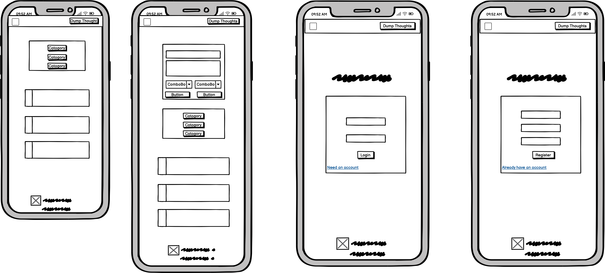
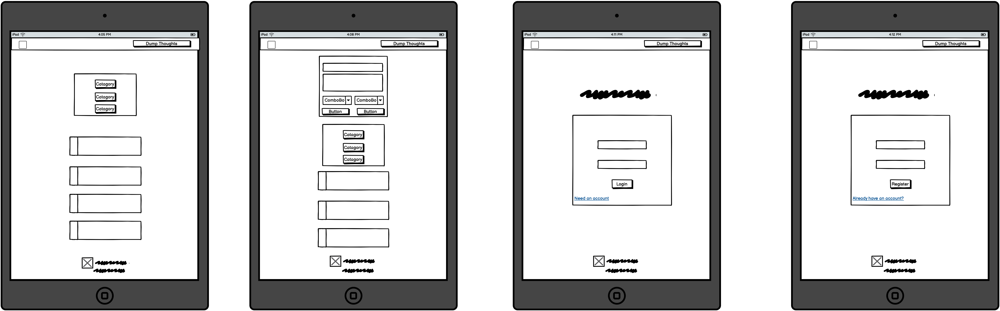
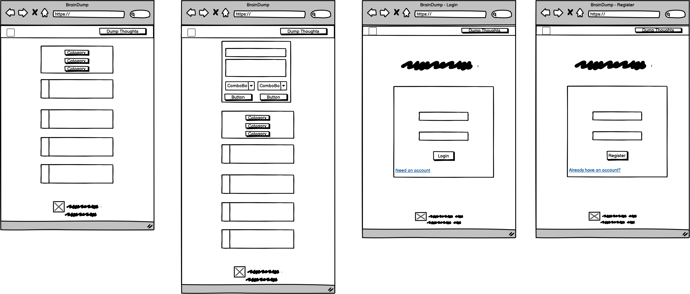
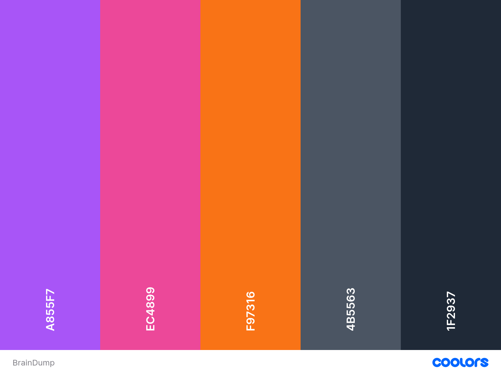
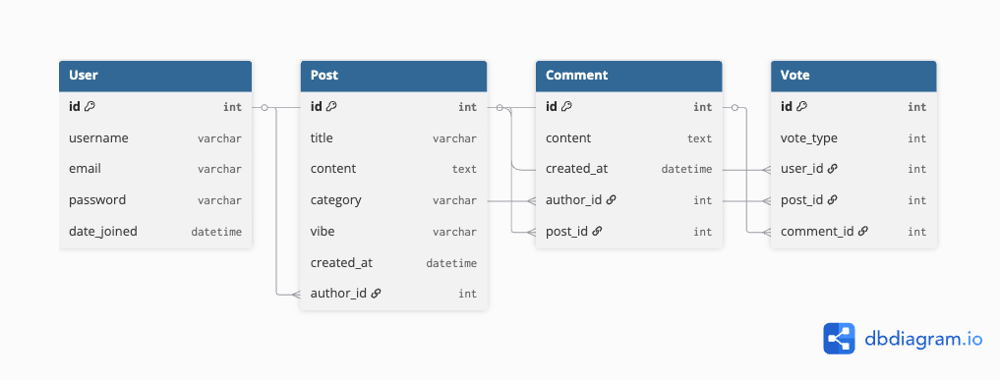

# BrainDump

BrainDump is a full-stack community discussion platform built with Django and Python where users can share thoughts, stories, and ideas in a playful, modern environment. The application features voting, commenting, category filtering, and user authentication.


---

## Contents

- [Project Rationale](#project-rationale)
- [Project Goals](#project-goals)
  - [User Goals](#user-goals)
  - [Site Owner Goals](#site-owner-goals)
- [User Experience (UX)](#user-experience-ux)
  - [Target Audience](#target-audience)
  - [User Stories](#user-stories)
  - [Design](#design)
    - [Wireframes](#wireframes)
    - [Color Scheme](#color-scheme)
    - [Typography](#typography)
    - [UX Design Principles](#ux-design-principles)
- [Features](#features)
  - [Existing Features](#existing-features)
  - [Future Enhancements](#future-enhancements)
- [Database Design](#database-design)
  - [Data Schema](#data-schema)
  - [Entity Relationship Diagram](#entity-relationship-diagram)
  - [Data Models](#data-models)

---

## Project Rationale

### Why BrainDump Exists

BrainDump was created to address the need for a more informal, personality-driven discussion platform that makes online discourse feel less serious and more enjoyable. Traditional forums and social media platforms often feel corporate or overwhelming, creating barriers to casual participation.

**The Problem:**
- Existing platforms feel too formal for everyday storytelling
- Users want personality-driven categorization instead of rigid structures
- Community platforms lack playful, modern aesthetics
- People need quick, accessible ways to share and discover content

**The Solution:**
BrainDump provides a welcoming space where users can:
- Post thoughts in humorous categories like "Oops I Did It Again" and "Brain Farts"
- Discover content through community voting rather than algorithms
- Experience immediate feedback through votes and comments
- Navigate intuitively with mobile-first responsive design
- Feel secure knowing their data is protected

**Value to Users:**
- **Community Building**: Connects people with shared interests in a welcoming environment
- **Entertainment**: Makes storytelling fun and engaging with playful categorization
- **Discovery**: Helps users find interesting content through voting and filtering
- **Accessibility**: Works seamlessly on any device, anywhere
- **Security**: Implements industry-standard authentication and data protection

**Value to Site Owner:**
- Demonstrates proficiency in full-stack Django development
- Shows understanding of UX principles and accessibility guidelines
- Proves ability to implement secure, scalable data management
- Creates a distinctive brand identity that stands out from competitors

This project was developed as part of the Level 5 Diploma in Web Application Development (Unit 3: Back End Development) and demonstrates comprehensive understanding of Python/Django, relational databases, security practices, and professional deployment.

[Back to Top](#contents)

---

## Project Goals

### User Goals

Users want to:
- **Share experiences and stories** in a welcoming, humorous environment without judgment
- **Discover engaging content** organized by relatable, quirky categories
- **Participate in discussions** through comments and voting on posts they find interesting
- **Track trending topics** based on community engagement rather than algorithmic manipulation
- **Experience seamless interaction** across all devices without technical difficulties
- **Feel confident** that their personal data is secure and private

### Site Owner Goals

As the site owner, I want to:
- **Build an active community** around shared interests and casual storytelling
- **Provide intuitive navigation** that requires minimal learning curve for new users
- **Create a distinctive brand identity** with personality-driven design that stands out
- **Demonstrate technical proficiency** in full-stack development with Django framework
- **Implement secure, scalable practices** following industry standards
- **Maintain the platform** with clear, well-documented code structure

### Development Goals

This project successfully demonstrates:
- ✅ Full-stack web application using Python and Django framework
- ✅ Custom responsive HTML and CSS with modern design principles
- ✅ Database-backed data storage using PostgreSQL in production
- ✅ Complete CRUD (Create, Read, Update, Delete) functionality
- ✅ User authentication and authorization with Django's built-in system
- ✅ Relational data modeling with proper relationships between entities
- ✅ Security best practices including environment variables and password hashing
- ✅ Comprehensive manual testing with documented results
- ✅ Cloud deployment to Heroku with production configuration
- ✅ Version control with meaningful Git commits throughout development
- ✅ Code following PEP8 style guidelines and W3C validation standards

[Back to Top](#contents)

---

## User Experience (UX)

### Target Audience

**Primary Audience:**
- Casual internet users (ages 18-45) who enjoy storytelling and humor
- Community seekers looking for less formal, personality-driven platforms
- Content creators who want to share experiences without academic pressure
- Digital natives who expect modern, responsive web interfaces

**Secondary Audience:**
- Students and professionals seeking lighter discussion platforms for downtime
- People tired of corporate social media looking for smaller, friendlier communities
- Anyone who enjoys quirky, humorous content and casual discourse

**User Needs Analysis:**
The target audience needs:
1. **Instant gratification** - Quick posting without complex forms or delays
2. **Visual appeal** - Modern, colorful design that's enjoyable to use
3. **Intuitive navigation** - No learning curve; obvious action buttons
4. **Mobile accessibility** - Seamless experience on phones and tablets
5. **Community feedback** - Immediate response to their contributions
6. **Data security** - Confidence that their information is protected
7. **Reliability** - Fast loading times and consistent performance

[Back to Top](#contents)

---

### User Stories

**First-Time Visitor:**
- As a first-time visitor, I want to immediately understand the site's purpose without reading documentation
- As a first-time visitor, I want to browse content without creating an account to evaluate the community
- As a first-time visitor, I want to easily find different content categories
- As a first-time visitor, I want the interface to work perfectly on my mobile device
- As a first-time visitor, I want to create an account quickly with minimal required information

**Registered User:**
- As a registered user, I want to log in securely and have my session remembered
- As a registered user, I want to create new posts with title, content, category, and mood
- As a registered user, I want to edit my own posts if I make a mistake or want to update content
- As a registered user, I want to delete my posts if I no longer want them public
- As a registered user, I want to leave comments on other people's posts
- As a registered user, I want to vote on posts and comments to influence content ranking
- As a registered user, I want to see my voting reflected immediately in the interface
- As a registered user, I want immediate feedback when I perform actions

**Frequent User:**
- As a frequent user, I want to view my post history and see all contributions I've made
- As a frequent user, I want to filter content by category to focus on topics I care about
- As a frequent user, I want consistent performance across all devices I use
- As a frequent user, I want the site to remember my preferences

**Site Administrator:**
- As an administrator, I want to moderate content that violates community guidelines
- As an administrator, I want to manage user accounts and handle reports
- As an administrator, I want to access Django admin panel for database management
- As an administrator, I want secure deployment with no exposed credentials

[Back to Top](#contents)

---

---

### Design

#### Wireframes

Wireframes were created using Balsamiq following a mobile-first approach, prioritizing content readability and interaction simplicity across all screen sizes.

**Mobile Wireframe (320px - 767px)**



- Single column layout maximizes content width on small screens
- Sticky header keeps branding and main CTA accessible
- Collapsible sidebar accessed via hamburger menu saves vertical space
- Large touch targets for all interactive elements (minimum 44x44px)
- Bottom-aligned primary CTA for thumb accessibility

**Tablet Wireframe (768px - 1023px)**



- Two-column grid introduces sidebar for categories (25% width)
- Sticky category sidebar provides quick filtering without scrolling
- Wider post cards with more visible metadata
- Expanded header with room for user profile dropdown

**Desktop Wireframe (1024px+)**



- Three-column layout maximizes wide screens
- Left sidebar: Categories (20% width)
- Center: Main post feed (60% width, max 800px for readability)
- Right sidebar: Trending content, user info (20% width)
- Enhanced hover states leverage mouse precision
- Multi-line post previews showing more content

[Back to Top](#contents)

---

#### Color Scheme

BrainDump uses a vibrant, energetic color palette that differentiates it from traditional discussion platforms while maintaining WCAG AA accessibility standards.



| Variable | Color (HEX) | Usage | Notes |
|----------|-------------|-------|-------|
| Purple 500 | #A855F7 | Primary buttons, active states | Creativity, imagination |
| Pink 500 | #EC4899 | Gradient midpoints, CTAs | Friendliness, approachability |
| Orange 500 | #F97316 | Gradient endpoints, energy accents | Energy, enthusiasm |
| Blue 50 | #EFF6FF | Cool background tones | Trust, calmness |
| Gray 600 | #4B5563 | Body text, metadata | Professional, readable |
| Gray 800 | #1F2937 | Headings, emphasis | Strong contrast |
| White | #FFFFFF | Card surfaces, button text | Clean, spacious |

**Gradient Styles:**
- **Primary CTA Gradient**: Purple → Pink → Orange (main action buttons)
- **Chaotic Vibe**: Purple → Pink (high energy posts)
- **Silly Vibe**: Yellow → Orange (playful posts)
- **Existential Vibe**: Blue → Indigo (contemplative posts)
- **Mindblowing Vibe**: Green → Teal (insightful posts)

**Accessibility Testing:**
All color combinations tested using WebAIM Contrast Checker and meet WCAG AA standards (minimum 4.5:1 for normal text, 3:1 for large text).

[Back to Top](#contents)

---

#### Typography

BrainDump uses system font stacks for optimal performance and native integration with users operating systems.

**Font Family:**
```
font-family: -apple-system, BlinkMacSystemFont, "Segoe UI", Roboto, 
             "Helvetica Neue", Arial, sans-serif;
```

**Rationale:**
- Zero latency (no external font files to download)
- Familiarity (uses native font of each OS)
- Accessibility (fonts optimized for screen reading)
- Performance (eliminates render-blocking requests)

**Font Weights:**
- **Headings**: 800-900 (ExtraBold/Black) - Maximum impact for titles
- **Body Text**: 500 (Medium) - More readable than regular weight
- **Metadata**: 500-600 (Medium/SemiBold) - Legible at smaller sizes
- **Buttons**: 900 (Black) - Commands attention
- **Captions**: 400 (Regular) - Visually de-emphasized

**Font Sizing (Mobile-First Approach):**
- Body: 16px minimum (prevents iOS zoom on input focus)
- H1: 32px → 48px (scales up on desktop)
- H2: 24px → 36px
- H3: 20px → 24px
- Small text: 14px minimum

All typography meets WCAG 2.1 Level AA standards with proper line height (1.5+) and letter spacing for optimal readability.

[Back to Top](#contents)

---

---

#### UX Design Principles

BrainDump follows five core UX principles to ensure an intuitive, accessible, and enjoyable user experience.

**1. Information Hierarchy**

The site uses semantic HTML5 structure and visual hierarchy to make content easily scannable:
- Large, bold post titles immediately catch attention
- Vote counts prominently displayed but don't overpower content
- Category badges use gradient backgrounds for visual separation
- Metadata (author, timestamp) consistently positioned
- Clear visual boundaries between posts using spacing and shadows

**Justification:** This approach allows users to scan content quickly and find what they need without reading every word. Consistent positioning creates familiarity that speeds up navigation.

**2. User Control**

Users initiate all actions with clear feedback:
- No autoplay media or aggressive pop-ups
- Voting provides immediate visual feedback
- Forms can be cancelled without submitting
- Clear error messages explain problems and solutions
- Success confirmations after all actions
- Users redirected appropriately after completing tasks

**Justification:** When users feel in control and receive clear feedback, they're more confident using the platform. The playful tone reduces anxiety around making mistakes.

**3. Consistency**

Similar elements behave similarly throughout the site:
- Border radius and styling uniform across all cards
- Gradient colors applied consistently to primary CTAs
- Vote buttons always positioned on left side
- All forms follow identical layout patterns
- Navigation elements behave predictably across pages

**Justification:** Consistency reduces cognitive load. Once users learn how one feature works, they can predict how others will work.

**4. Confirmation**

Users receive feedback on their actions:
- Vote counts update immediately when clicked
- Form submissions show success messages
- Button hover states confirm clickability
- Page titles update to reflect current state
- Loading states indicate when data is being fetched

**Justification:** Clear confirmation prevents user anxiety ("Did my action work?") and reduces repeated actions.

**5. Accessibility**

The site follows WCAG 2.1 Level AA guidelines:
- Semantic HTML5 elements throughout
- Keyboard navigation fully supported (Tab, Enter, Escape)
- Color contrast meets AA standards (4.5:1 for text)
- All form inputs have associated labels
- Touch targets meet minimum size (44x44px on mobile)
- Screen reader compatible with ARIA labels

**Justification:** Accessibility is legally required and morally right. Making the platform usable by everyone increases the potential user base and creates a more inclusive community.

**Design Decisions:**

Some design choices deliberately differ from conventional patterns:
- **Vibrant gradients** used extensively for modern, dynamic feel appropriate for younger audience
- **Playful microcopy** ("Brain Zones," "Dump Thoughts") creates personality and differentiates from sterile platforms
- **Animated hover states** enhance playful feel and provide clear affordance
- **Informal error messages** maintain friendly tone even during errors

All decisions serve the core goal: **making discourse feel less formal and more enjoyable** while maintaining usability standards.

[Back to Top](#contents)

---

## Features

### Existing Features

#### 1. User Authentication & Authorization


**Description:** Secure user registration, login, and session management using Django's built-in authentication system.

**Features:**
- User registration with email and password
- Secure password hashing using Argon2 algorithm
- Remember Me functionality for persistent sessions
- Password reset via email
- Login required for creating posts/comments
- Users can only edit/delete their own content
- Admin users have elevated permissions for moderation

**User Benefit:** Creates persistent identity, protects user data, and ensures only authorized users can modify content.

---

#### 2. Post Management (Full CRUD)


**Create:** Users can create posts with:
- Title (max 200 characters)
- Content (max 5000 characters)
- Category selection (6 humorous options)
- Vibe/mood selector (Chaotic, Silly, Existential, Mindblowing)

**Read:** All users can:
- Browse posts in feed (reverse chronological order)
- View full post details
- Filter by category
- Sort by newest, most voted, most commented

**Update:** Post authors can:
- Edit title, content, category, vibe
- Changes reflected immediately
- Updated timestamp tracked automatically

**Delete:** Post authors can:
- Delete posts with confirmation modal
- Associated comments and votes removed automatically
- Success feedback and redirect to feed

**User Benefit:** Complete control over own content with intuitive interface.

---

#### 3. Commenting System


**Features:**
- Comment form below each post
- Comments display author, timestamp, content, votes
- Comments listed chronologically (oldest first)
- Edit/Delete buttons for own comments
- Comment voting system
- Empty state with friendly message

**User Benefit:** Enables discussion and community engagement directly on posts.

---

#### 4. Voting System


**Features:**
- Upvote button increases count by 1
- Downvote button decreases count by 1
- Clicking same button removes vote
- One vote per user per post/comment (database enforced)
- Cannot vote on own content
- Vote count color-coded by score
- Immediate UI updates without page reload

**User Benefit:** Community-curated content where best posts rise to top.

---

#### 5. Category Filtering


**Categories Available:**
1. **Everything** (All posts - default view)
2. **Oops I Did It Again** (Embarrassing mistakes)
3. **Pet Nonsense** (Funny pet stories)
4. **Existential Dread** (Deep life questions)
5. **Shower Thoughts** (Random realizations)
6. **Brain Farts** (Silly forgetful moments)
7. **Plot Twists** (Unexpected endings)

**Features:**
- Category sidebar with post counts
- Active category highlighted
- Filter persists in URL
- Sticky sidebar on desktop

**User Benefit:** Focus on topics of interest without scrolling through irrelevant content.

---

#### 6. Responsive Design


**Features:**
- Mobile (<768px): Single column, stacked layout, hamburger menu
- Tablet (768-1023px): Two columns with visible sidebar
- Desktop (1024px+): Three columns with sticky sidebars
- Fluid typography scales appropriately
- Touch targets minimum 44x44px on mobile
- No horizontal scrolling at any width

**User Benefit:** Seamless experience on any device, anywhere.

---

#### 7. Time-Based Display

**Features:**
- Relative timestamps: 2s ago, 5m ago, 3h ago, 2d ago
- Hover shows exact date/time
- Applied to posts and comments

**User Benefit:** Quickly understand content freshness without reading full dates.

---

### Future Enhancements

**Phase 2 (Immediate Improvements):**
- User profiles with post history and karma scores
- Email notifications for comment replies
- Search functionality across posts and comments
- Advanced sorting algorithms (trending, hot, controversial)

**Phase 3 (Advanced Features):**
- Nested comment threads with collapsible sections
- Rich text editor with image uploads and markdown
- Private messaging between users
- User following system and personalized feeds

[Back to Top](#contents)

---

## Database Design

### Data Schema

BrainDump uses PostgreSQL with Django ORM for robust, relational data storage that supports all CRUD operations while maintaining referential integrity.

**Design Principles:**
- Normalized database structure (3NF) to minimize redundancy
- Proper foreign key relationships with CASCADE deletion
- Indexed fields for optimized query performance
- Data validation at both model and database levels

---

### Entity Relationship Diagram



**Core Entities:**
- **User** (Django's built-in auth_user table)
- **Post** (User-created content)
- **Comment** (Discussion on posts)
- **Vote** (Upvotes/downvotes on posts and comments)

**Relationships:**
- User → Post (One-to-Many): One user creates many posts
- User → Comment (One-to-Many): One user creates many comments
- User → Vote (One-to-Many): One user creates many votes
- Post → Comment (One-to-Many): One post has many comments
- Post → Vote (One-to-Many): One post has many votes
- Comment → Vote (One-to-Many): One comment has many votes

---

### Data Models

#### User Table
Django's default `auth_user` table with fields:
- `id` (Primary Key) - Unique user identifier
- `username` (Unique, max 150 chars) - User's display name
- `email` (Unique) - User's email address
- `password` (Hashed) - Argon2 hashed password
- `is_staff` (Boolean) - Admin access flag
- `is_active` (Boolean) - Account status
- `date_joined` (DateTime) - Registration timestamp

#### Post Table
- `id` (Primary Key) - Unique post identifier
- `title` (CharField, max 200) - Post title
- `content` (TextField, max 5000) - Post body content
- `category` (CharField) - One of 6 predefined categories
- `vibe` (CharField) - One of 4 mood options
- `created_at` (DateTime) - Post creation timestamp
- `updated_at` (DateTime) - Last edit timestamp
- `author_id` (Foreign Key → User) - Post author reference

**Constraints:**
- `category` must be: 'oops', 'pets', 'existential', 'shower', 'brain', 'plot'
- `vibe` must be: 'chaotic', 'silly', 'existential', 'mindblowing'
- ON DELETE CASCADE for author_id
- Indexed: author_id, category, created_at

#### Comment Table
- `id` (Primary Key) - Unique comment identifier
- `content` (TextField, max 2000) - Comment text
- `created_at` (DateTime) - Comment creation timestamp
- `updated_at` (DateTime) - Last edit timestamp
- `author_id` (Foreign Key → User) - Comment author reference
- `post_id` (Foreign Key → Post) - Parent post reference

**Constraints:**
- ON DELETE CASCADE for author_id and post_id
- Indexed: author_id, post_id, created_at

#### Vote Table
- `id` (Primary Key) - Unique vote identifier
- `vote_type` (Integer) - 1 for upvote, -1 for downvote
- `created_at` (DateTime) - Vote timestamp
- `user_id` (Foreign Key → User) - Voter reference
- `post_id` (Foreign Key → Post, nullable) - Post being voted on
- `comment_id` (Foreign Key → Comment, nullable) - Comment being voted on

**Constraints:**
- Either post_id OR comment_id must be set (not both, not neither)
- UNIQUE (user_id, post_id) - One vote per user per post
- UNIQUE (user_id, comment_id) - One vote per user per comment
- ON DELETE CASCADE for all foreign keys
- Indexed: user_id, post_id, comment_id

---

**Database Configuration:**
- **Development**: SQLite3 for local development
- **Production**: PostgreSQL on Heroku for robust, scalable data storage
- **Migrations**: All schema changes tracked via Django migrations
- **Backup**: Heroku automated daily backups with 7-day retention

[Back to Top](#contents)

---

